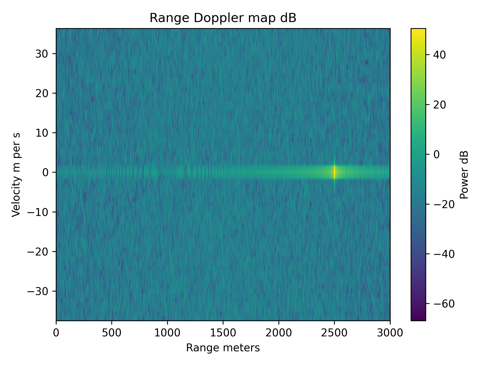

# Range–Doppler Radar Simulation

This project implements an end-to-end pulsed radar signal processing chain in Python.

The simulation includes:
- Linear frequency-modulated (LFM) chirp generation
- Target reflection modeling with 1/r^4 propagation loss
- Additive white Gaussian noise
- Matched filtering for pulse compression
- Doppler processing using FFT across pulses
- Range–Doppler map visualization
- CFAR-style adaptive detection 

## Example Output



## Tools and Technologies
- Python
- NumPy
- SciPy
- Matplotlib

## How to Run
```bash
pip install -r requirements.txt
python range_doppler_sim.py
